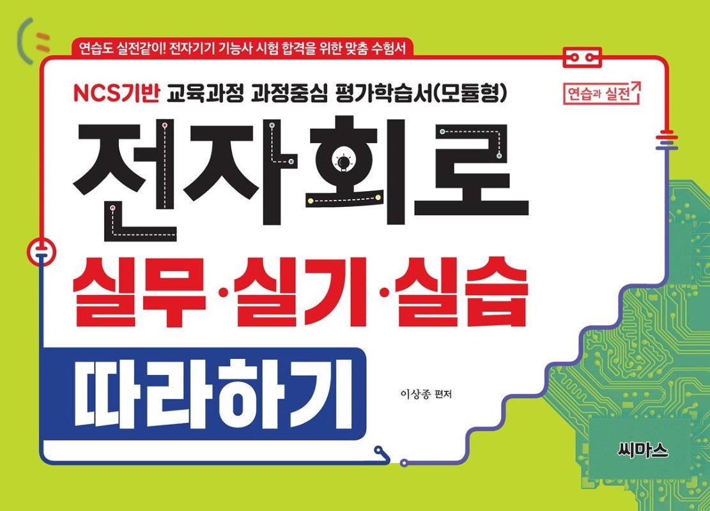
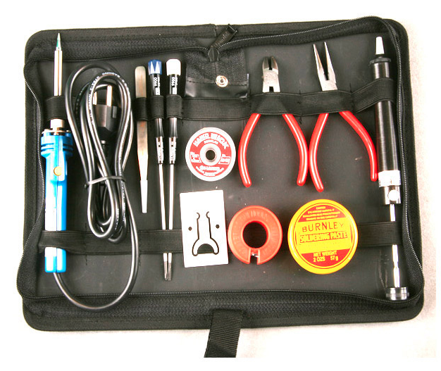

# [공통] 전자회로 조립 및 측정
## 교재

- 구입 링크 http://www.yes24.com/Product/Goods/72263024

## 필요한 공구

- 구입 링크 https://www.devicemart.co.kr/goods/view?no=39047
### 납땜 기초 동영상
- https://youtu.be/plVfzJjY-jc
- https://youtu.be/ZIR3oaAjz34