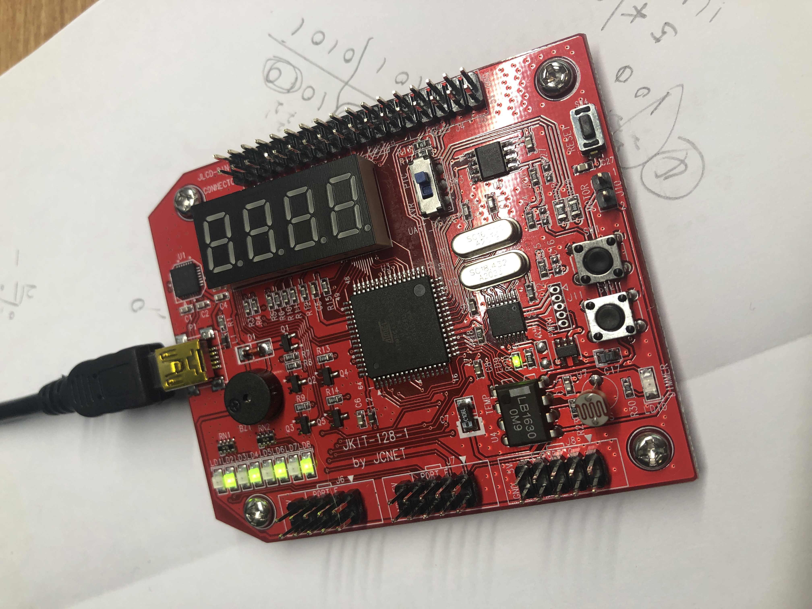
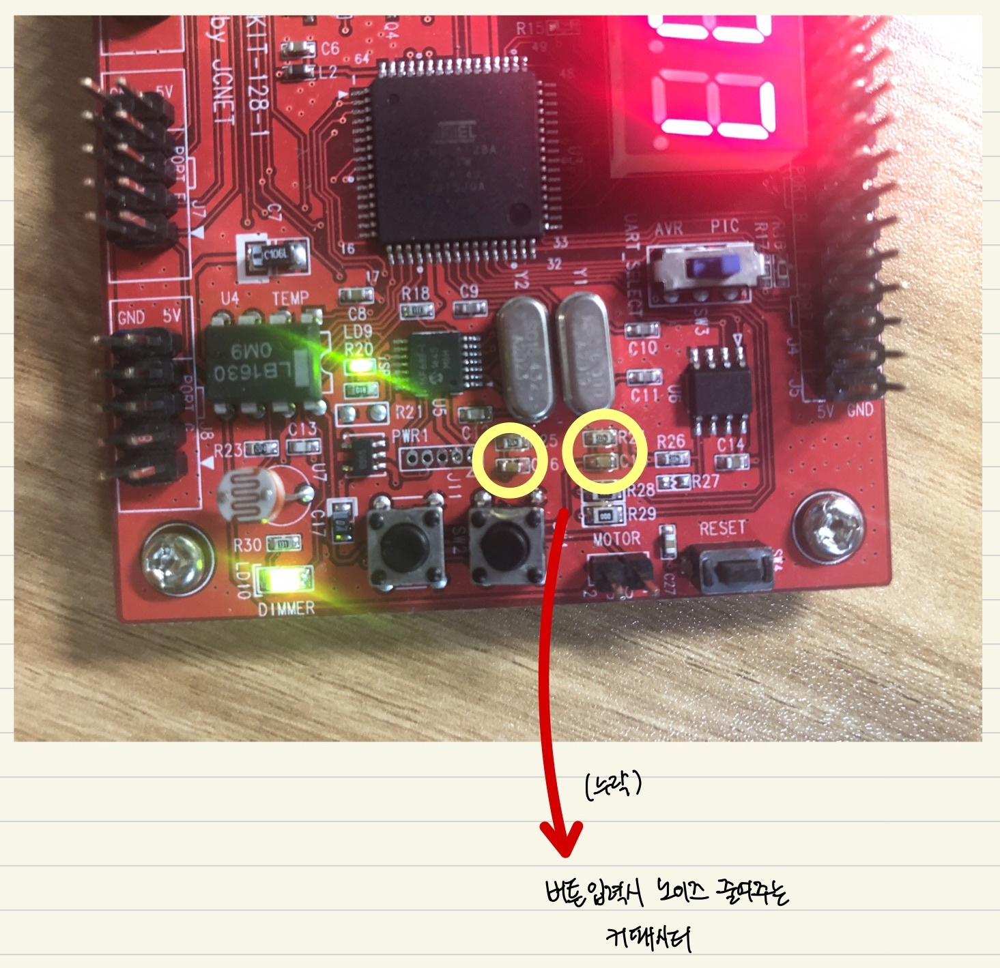

# 서울 2020 AVR 

## 구매링크
https://www.devicemart.co.kr/goods/view?no=1059759

## 2020 마프기출
1. sw1 눌렀을때 LED 좌우 스프트
2. sw2 눌렀을때 LED 홀짝 변경
3. 동영상 => etc폴더~!!
---
## [제이씨넷] Atmega128 AVR 개발/실습키트 JKIT-128-1
### 알려진 문제점

솔류션 => C15, C16에 커패시터를 달아서 해결
